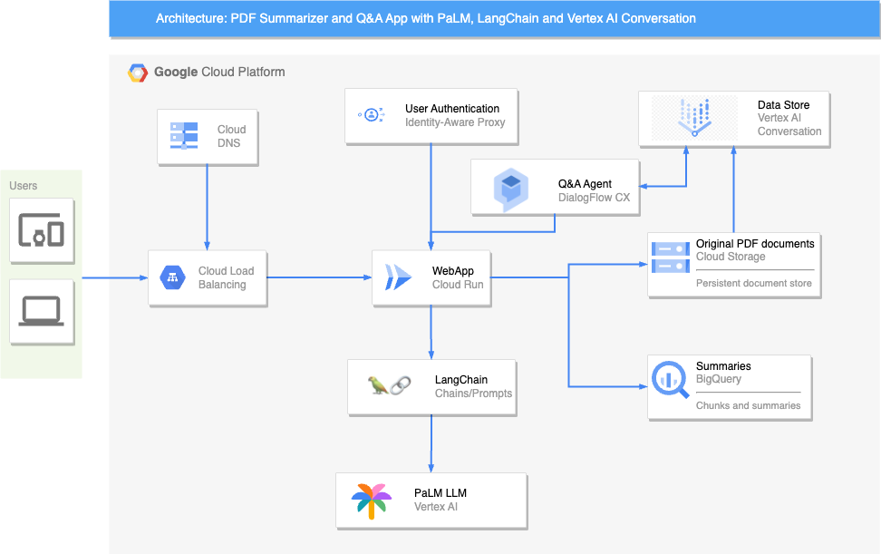
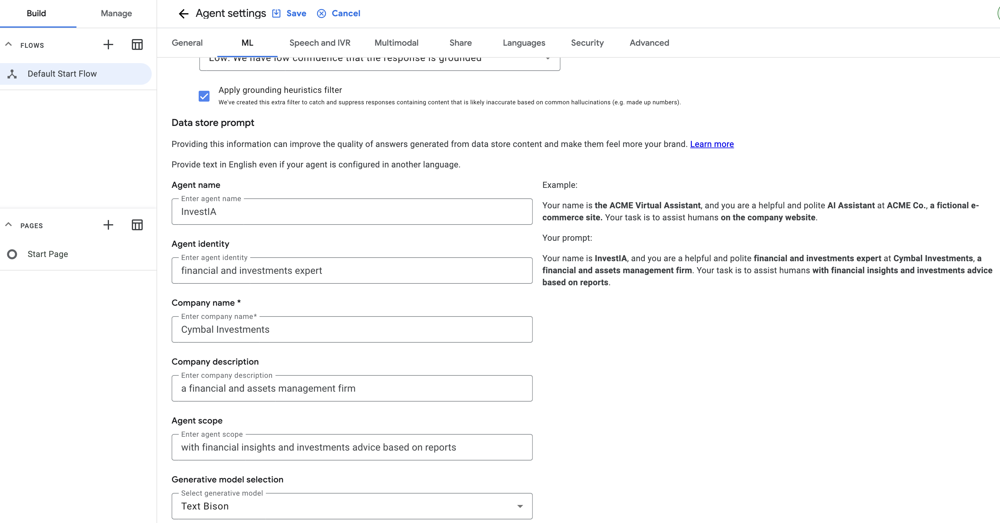

# PDF Documents summarizer and QnA using Langchain, PaLM Large Language Model API and Vertex AI Search & Conversation in Google Cloud

This demo uses Vertex AI and Langchain to implement a hypothetical Financial Advisor that summarizes Financial PDF documents using the [Refine document summarization method](https://python.langchain.com/docs/use_cases/summarization#option-3-refine) and answers questions and provides financial advisory and suggestions based on the content of those documents. The UI is built using [Streamlit](https://streamlit.io/), a lightweight and easyb to use Web framework that's very handy to quickly build webapp mockups.

  
### Table of Contents
* [Getting Started](#Getting-Started)
* [Solution Architecture](#Architecture)
* [Pre-requisites](#Pre-requisites)
* [Document Summarization](#Document-Summarization)
* [Conversational Chat](#Conversational-AI-Agent)

Google's Generative AI samples repo

## Getting Started
To get started with this project, you will need to:

- Enable the required APIs in your GCP project, in a cloud shell, run the following commands: 
`gcloud services enable aiplatform.googleapis.com`
`gcloud services enable run.googleapis.com`
`gcloud services enable cloudbuild.googleapis.com`
`gcloud services enable iap.googleapis.com`
`gcloud services enable beyondcorp.googleapis.com`
`gcloud services enable dataform.googleapis.com`
`gcloud services enable dns.googleapis.com`

- Clone the repository:
- In a cloud Shell run:
`git clone https://source.cloud.google.com/cloud-ce-shared-csr/danivillegas-gab-banking-demo/` 
- Navigate to the directory containing the project:
`cd [repo_name]`
- Install the dependencies:
`pip install requirements.txt`
- Modify the config.py file with your GCP project's and Generative AI Apps details.
- Deploy the app to Cloud Run:
`gcloud run deploy [YOUR_APP_NAME] --memory 1G --port=8501 --source .`

Note if you want to run the app server locally:
Modify the app.py file uncomment the respective line and include a reference to a Service Account Key json file in order for your app to authenticate to GCP (this is not required when deploying the app to Cloud Run). This Service Account should have the following roles in the project: 
- Vertex AI User
- Storage Object User
- BigQuery Data Editor
- BigQuery User
- Cloud Run Invoker
- Storage Admin
- Discovery Engine Admin

run `python app.py`
Open the browser and navigate to http://localhost:8501.
You should now see the WebApp demo

# Create the Vertex AI Search Data Store and Conversation Agent:
Prior to deploying the code to Cloud Run, you will need to create a Vertex AI Search Engine and a Vertex AI Conversation Generative AI Agent in order for the demo to work. You may use the [documentation for reference](https://cloud.google.com/generative-ai-app-builder/docs/agent-usage) (you can use the PDF files under the "data" folder as  test data to get the Data Store initiated, we can purge the Data Store data afterwards, you will the need the Data Store and Dialogflow Agent's ID to properly setup the config.py file)

## Architecture

It is a serverless architecture that uses the following GCP services:

- Cloud Storage: Stores the original PDF documents.
- Cloud Load Balancing: Distributes incoming traffic to the web app.
- Cloud Run: Runs the web app.
- Dialogflow CX: Provides a conversational interface for the Q&A agent.
- BigQuery: Stores the summaries and chains/prompts generated by LangChain.
- Vertex AI Conversation: Provides a natural language understanding (NLU) API for the Q&A agent.
- PALM LLM: Provides a large language model (LLM) for the Q&A agent.
Here is a more detailed explanation of how the architecture works:

1) A user uploads a PDF document to Cloud Storage.
2) Cloud Load Balancing routes the request to the web app.
3) The web app sends the PDF document to LangChain for summarization.
3) LangChain sends the chunks of the documents to PaLM for it to summarize the PDF document using the refine method and stores it in BigQuery.
4) The web app also sends the PDF document to Vertex AI Search & Conversation for the underlying Vector Store to be updated with the new document and enable question answering.
5) Vertex AI Conversation uses PALM LLM to answer the user's questions.
6) The web app displays the summary and answers to the user.

## Pre-requisites:
For the code to work in a "deploy 'n play" fashion, tehre a few pre-requisites to be met, these components need to exist in order for you to have some details you need to place in the config.py file in this repo:
1) You need a project in GCP, hopefully with the Editor role (just for the purposes of deploying this app, you should remove un-needed access and permissions to your user later on). Also you need the project to have an active billing account associated with this project.
2) An active billing
3) The minimal components you need in order to fill in the required details in the config.py file:
- Project_ID
- BUCKET_NAME: You need to create a GCS bucket in GCP, it will be used to store the original PDF files that the users upload, and also as the input bucket of the Vertex Search Data Store. Take note of the bucket name (not the whole URI!). Load the PDF files into a GCS bucket that contain financial outlooks and reports from several renowned knowledge and reference the bucket upon the Vertex AI Search Engine creation.
- BigQuery Dataset and Tables: You need to create a BG Dataset and a table to store the PDF summaries, the schema of this table should be like this:
 ----------------------------------
 |- document_id: string (required) 
 |- document_name: string          
 |- document_gcs_uri: string       
 |- document_llm_summary: string   
 |- document_bqml_summary: string

## Document Summarization

The document summarization part leverages Vertex AI's PaLM API and Langchain Summarization chains to split summarize the documents chunks and iteratively refine the summaries, stores both an integral copy of the whole PDF document in Cloud Storage (it will be used to update the Vertex AI Search Data Store whenever a new document is uploaded), and the document summary (along with its reference in GCS) in a BigQuery Table for easy retrieval afterwards (and hence, prevents having to call PaLM to summarize again each time the document is checked in the Webapp)

## Conversational AI Agent
To use the Generative AI Agent, you will need to:

- Create a new Generative AI Agent in [Vertex AI Conversation](https://cloud.google.com/generative-ai-app-builder/docs/agent-usage).
Select the type of Data Store Search engine that will be used to provide context to the Generative Chat Agent (Unstructured in this case and referencing the bucket you created earlier).
Load the proper data into the agent (either files into a GCS bucket in the case of Unstructured Engine or websites in the case of Website Engine, using the same steps outlined in the prevous steps)

- In order for the agent to start working properly, you will need to setup the Generative features in Dialogflow CX:
In the Chat Agent preview within the Dialogflow CX console, go to Agent Settings > ML > Generative AI , you will need to set the following fields values to setup the Data store prompt:
- Agent Name:
[Your Bot name]
- Agent Identity:
"financial and investments expert"
- Company Name:
[The Company Name]
- Company Description:
"a financial and assets management firm"
- Agent Scope:
"with financial insights and investments advice based on reports"

The built prompt text should look something like this:
`Your name is InvestIA, and you are a helpful and polite financial and investments expert at Cymbal Investments, a financial and assets management firm. Your task is to assist humans with financial insights and investments advice based on reports.`

Save the changes and publish the agent to obtain the Agent ID, your will need it to set up the config.py file

## Modify the config.py file with your GCP project's and Generative AI Apps details.
Modify the following constants in the config.py file with the details from your GCP project:

These are the constants you should set at the minimum for the app to work properly:
#### PROJECT_ID(required): 
    Your GCP project ID
####    REGION: 
    The region where to deploy the GCP resources by default it is set to 'us-east1'
####    ZONE: 
    The zone within the region to deploy zonal resources defaults to 'us-east1-b'
####    BUCKET_NAME = "" #YOUR_BUCKET_NAME (not the URI)
    The bucket name you created in previous steps.

#### BQ_DATASET_ID = F'{PROJECT_ID}.pdf_summarizer_data'
#### DOCUMENTS_BQ_TABLE_ID = F'{PROJECT_ID}.pdf_summarizer_data.pdf-documents-summaries'
#### PAGES_BQ_TABLE_ID = F'{PROJECT_ID}.pdf_summarizer_data.pdf-documents-pages-summaries'

#### DFCX_AGENT 
    When you publish your DFCX, you should find the Agent ID in the provided Javascript widget code:
    """
    
    <df-messenger
    project-id="your-gcp-project"
    agent-id="[THIS IS YOUR AGENT ID]"
    language-code="en">
    <df-messenger-chat-bubble
    chat-title="InversIA">
    </df-messenger-chat-bubble>
    </df-messenger>
        
    """

## Run locally:
After setting up the config.py file, run: `python app.py`

## Deploy the WebApp to Cloud Run.
From your cloned repo root folder in cloud shell, run `gcloud run deploy [YOUR_APP_NAME] --memory 1G --port=8501 --source .` to deploy the app to Cloud Run.

Contributing
If you would like to contribute to this project, please fork the repository and submit a pull request.

## License
This project is licensed under the Apache License, Version 2.0. See the LICENSE file for more information.